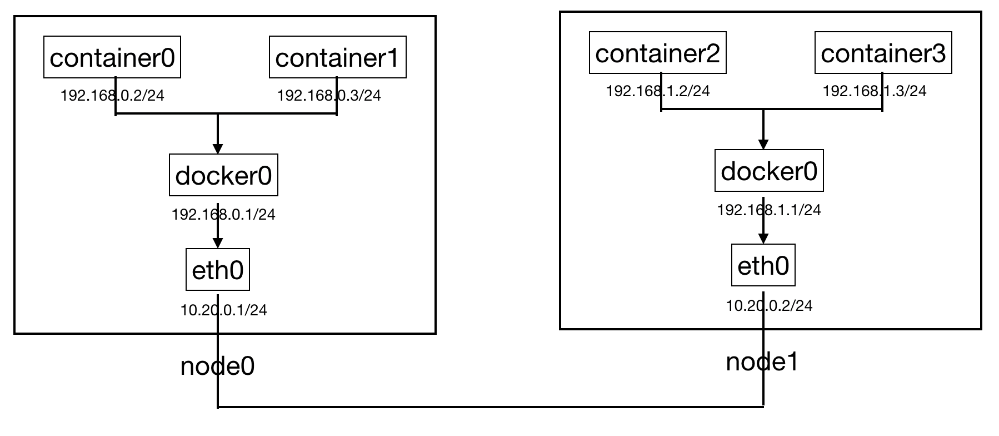

# Host-gw

## 1. Host-gw原理

Host-gw并不是一个linux里类似vxlan的专有概念，它只是[Flannel](https://github.com/coreos/flannel)里的一个利用route表实现不同主机上container互连的[backend](https://github.com/coreos/flannel/blob/master/Documentation/backends.md)，当然前提条件是各主机在一个子网内，是layer2互通的。如下图所示，node0和node1之间可以通过eth0互连，但container0和container2无法互连，如果想让它们之间能通信，可以怎么做呢？本文主要介绍host-gw方法。



container0和container2无法互连的原因在于：当container0发往container2的包（container2向container0发包也是类似的情况）经过eth0时，内核将查找route表规则，显然不能找到符合192.168.1.2/24（container2的ip）的规则，因此只能发往默认路由（一般是gateway网关），事实上gateway也不能找到符合192.168.1.2/24的规则，最终所有的路由器都不知道目标ip地址为192.168.1.2/24的包该发到哪个主机上。

知道这个原因后，你可能会想：如果在node0上创建一条route表规则，让目标地址为192.168.1.2/24的包全部发往node1，那不就解决问题了？是的，host-gw正是这样解决的：在node0上创建route表规则（`ip route add 192.168.1.0/24 via 10.20.0.2 dev eth0`），让目标地址为192.168.1.0/24的包全部发往node1，在node1上创建route表规则（`ip route add 192.168.0.0/24 via 10.20.0.1 dev eth0`），让目标地址为192.168.0.0/24的包全部发往node0，这样node0和node1上的container就可以互相通信了。

## 2. Host-gw实验

**实验环境**：Mac, [Vagrant](https://www.vagrantup.com/intro/index.html), [Vagrant file以及相应的配置脚本](../../vagrants/host-gw-vagrant)

在Vagrant file所在目录执行`vagrant up`后，将启动3个安装了docker的节点node0、node1、node2（这个实验只需要用到两个节点即可）。

接下来，我们为node0（对外通信的网卡为enp0s8，ip为172.28.128.9）和node1（对外通信的网卡为enp0s8，ip为172.28.128.10）上的docker分别配置ip段192.168.0.1/24和192.168.1.1/24，并加上相应的route表。

```
# node0配置
root@node0:~# /vagrant/config_docker0.sh 192.168.0.1/24 192.168.0.1/24
root@node0:~# ip route add 192.168.1.0/24 via 172.28.128.10 dev enp0s8 
root@node0:~# iptables -A FORWARD -s 192.168.0.0/16 -j ACCEPT
root@node0:~# iptables -A FORWARD -d 192.168.0.0/16 -j ACCEPT
root@node0:~# echo 1 > /proc/sys/net/ipv4/ip_forward

# node1配置
root@node1:~# /vagrant/config_docker0.sh 192.168.1.1/24 192.168.1.1/24
root@node1:~# ip route add 192.168.1.0/24 via 172.28.128.9 dev enp0s8 
root@node1:~# iptables -A FORWARD -s 192.168.0.0/16 -j ACCEPT
root@node1:~# iptables -A FORWARD -d 192.168.0.0/16 -j ACCEPT
root@node1:~# echo 1 > /proc/sys/net/ipv4/ip_forward
```

说明：从docker 1.13开始，docker会将FORWARD表的默认规则改为DROP，导致从container0到container2的包虽然被正确转到node1上了，但是会被drop掉，因此我们在上面增加了两条ACCEPT规则，让容器间的包通过。另外，要确保`/proc/sys/net/ipv4/ip_forward`值为1(小知识：[What is kernel ip forwarding](https://unix.stackexchange.com/questions/14056/what-is-kernel-ip-forwarding))，这样container0的包到了node1上，才会经由enp0s8雷劈到docker0再转到container2上。

现在可以在node0和node1上分别启动一个container(`docker run -it hex108/ubuntu:ping bash`)，然后ping对方了。

## 3. Host-gw on Flannel

Flannel的host-gw方案和上文实验中一样，只不过我们不用手动增加route表和iptables规则了。

下面通过实验来说明flannel host-gw的一些细节，实验环境使用上面使用vagrant创建的3个节点（node0对外通信的网卡为enp0s8，ip为172.28.128.9，node1对外通信的网卡为enp0s8，ip为172.28.128.10，node2对外通信的网卡为enp0s8，ip为172.28.128.11）。

首先，在node2上安装最新版本的etcd，并将各节点上flannel可以申请使用的ip地址范围`192.168.0.2/16`配置到etcd上，并指定flannel使用的backend类型为host-gw。

```
root@node2:~# wget https://github.com/etcd-io/etcd/releases/download/v3.3.10/etcd-v3.3.10-linux-amd64.tar.gz
root@node2:~# etcd-v3.3.10-linux-amd64/etcd --advertise-client-urls 'http://172.28.128.11:2379' --listen-client-urls 'http://172.28.128.11:2379'
root@node2:~# /etcd-v3.3.10-linux-amd64/etcdctl --endpoints="http://172.28.128.11:2379" set /coreos.com/network/config '{ "Network": "192.168.0.2/16", "Backend": {"Type": "host-gw"}}'
```

其次，在node0和node1上安装启动flannel，并配置docker。启动flannel后，flannel会通过[Leases and Reservations](https://github.com/coreos/flannel/blob/master/Documentation/reservations.md)机制向etcd“申请”一块ip地址，并将它写入文件`/run/flannel/subnet.env`，配置docker时，docker0的bip地址来源于它。同时，flannel会增加前面提到的两条iptables规则，并开始监听etcd，当它发现其他节点也从etcd申请一块ip地址后，它就会创建一条相应的route表规则，这样这两台机器上container之间就可以互相通信了，例：node0上的flannel监听到node1上的flannel申请ip地址块`192.168.1.0/24`后，它就会创建一条相应的route表`ip route add 192.168.1.0/24 via 172.28.128.10 dev enp0s8`。如果有新的节点增加进来，比如新加进来节点node3，它会为所有已经存在的flannel创建相应的route表规则，这样这机器上的container就能和其他节点上的container通信了。可以发现，如果有大量节点，机器上将会有大量相应的route表规则。

```
# node0
root@node0:~# wget https://github.com/coreos/flannel/releases/download/v0.10.0/flanneld-amd64 && chmod +x flanneld-amd64
root@node0:~# ./flanneld-amd64 -etcd-endpoints "http://172.28.128.11:2379" -iface enp0s8 -public-ip 172.28.128.9
root@node0:~# /vagrant/config_docker0_with_flannel.sh

# node1
root@node0:~# wget https://github.com/coreos/flannel/releases/download/v0.10.0/flanneld-amd64 && chmod +x flanneld-amd64
root@node0:~# ./flanneld-amd64 -etcd-endpoints "http://172.28.128.11:2379" -iface enp0s8 -public-ip 172.28.128.10
root@node0:~# /vagrant/config_docker0_with_flannel.sh
```

现在可以在node0和node1上分别启动一个container(`docker run -it hex108/ubuntu:ping bash`)，然后ping对方了。

## 4. 参考资料

* flannel host-gw模式工作原理浅析: https://blog.csdn.net/cloudvtech/article/details/79809569
* flannel host-gw network: http://hustcat.github.io/flannel-host-gw-network/
* Routing table: https://en.wikipedia.org/wiki/Routing_table
* What is kernel ip forwarding: https://unix.stackexchange.com/questions/14056/what-is-kernel-ip-forwarding
* Setting Up Gateway Using iptables and route on Linux: https://www.systutorials.com/1372/setting-up-gateway-using-iptables-and-route-on-linux/
* Running flannel: https://github.com/coreos/flannel/blob/master/Documentation/running.md